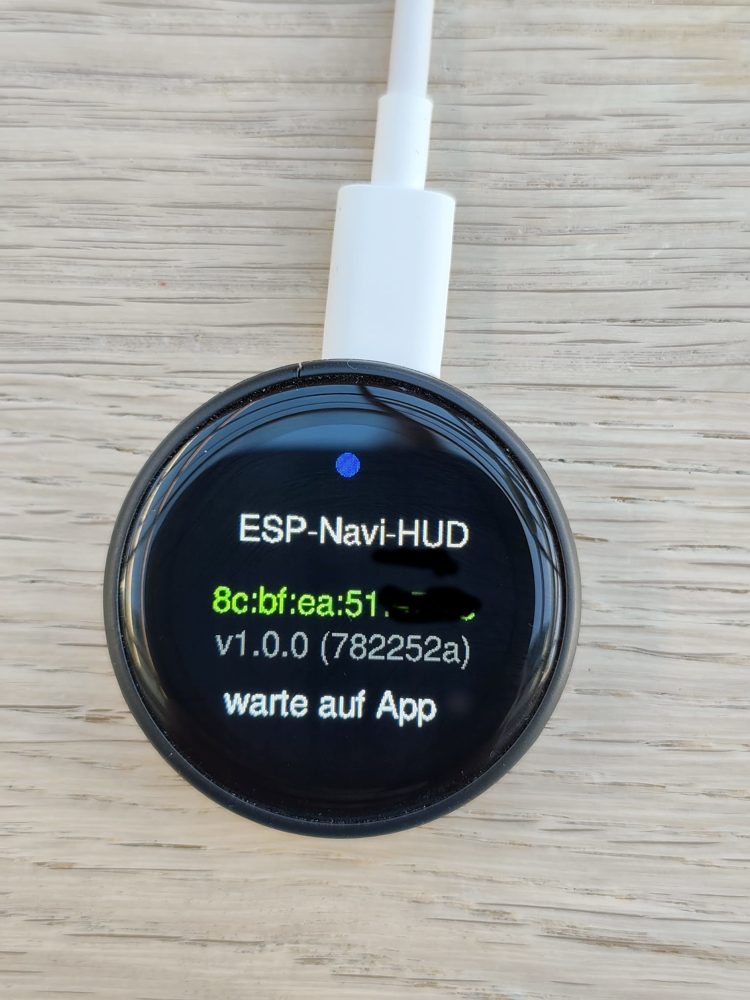
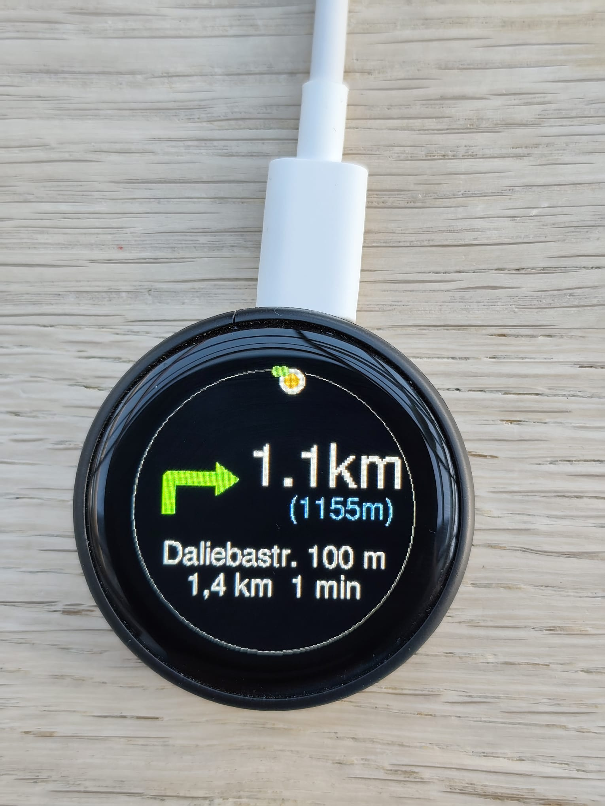
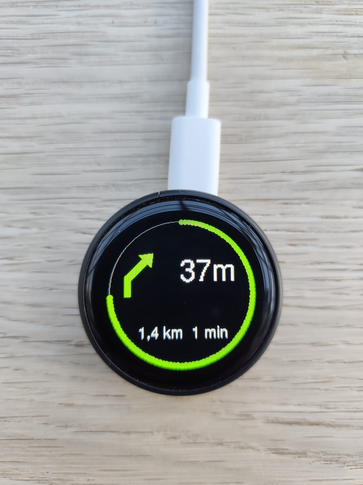

# BikeNav_C3 - Smart Bike HUD

BikeNav_C3 ist ein minimalistisches, Bluetooth-basiertes Head-Up-Display (HUD) für Fahrräder, basierend auf dem ESP32-C3 und einem 1.28" Rund-Display (GC9A01). 

### Wofür ist dieses Device?
Das BikeNav_C3 verwandelt dein Smartphone in ein diskretes Navigationssystem. Anstatt während der Fahrt ständig auf das Handy am Lenker schauen zu müssen, liefert das HUD präzise Richtungsanweisungen direkt in dein Sichtfeld. Es ist ideal für:
* **Sicheres Radfahren**: Fokus bleibt auf der Straße, nicht auf dem Smartphone-Display.
* **Minimalistisches Cockpit**: Kein klobiges Handy am Lenker, sondern ein elegantes, rundes Display.
* **Wetterunabhängigkeit**: Das Display ist auch bei direkter Sonneneinstrahlung gut ablesbar.

## 📲 Die Android Bridge App
Das Herzstück des Systems ist die Kopplung mit der **Android Bridge App**. Diese fungiert als intelligentes Bindeglied zwischen dem Smartphone und dem HUD:
* **TTS-Schnittstelle**: Die Bridge App nutzt die Sprachausgabe (Text-to-Speech) des Android-Systems und wandelt diese in Echtzeit in visuelle Befehle für das Display um.
* **Getestete Kompatibilität**: Das System ist unabhängig von der genutzten Karten-App. Es wurde erfolgreich getestet mit:
    * **Organic Maps** (und deren Forks)
    * **OsmAnd**
    * Allen Navigationssystemen, die standardisierte Android-Sprachanweisungen nutzen.

## ✨ Kernfunktionen
* **Echtzeit-Navigation**: Anzeige von Abbiegehinweisen (Icons), Distanzen und Straßennamen.
* **Smart Preview**: Vorausschauendes Icon für den darauffolgenden Manöver-Schritt ("Danach links").
* **Dynamische Distanzberechnung**: Automatisches Herunterzählen der Meter basierend auf der aktuellen Geschwindigkeit (`SPD-CALC`), auch wenn die App gerade keine Daten sendet.
* **Intelligentes UI**: 
    * Startscreen mit MAC-Adresse zur einfachen Kopplung.
    * Farbliches Feedback bei kritischen Distanzen (Orange-Alarm bei < 30m).
* **Gestensteuerung**: Helligkeitsregelung und Display-Rotation (0-270°) per Touch-Geste am Display.

## 🛠 Hardware
* **Controller**: ESP32-C3 (RISC-V).
* **Display**: 1.28 Zoll Round-LCD, 240x240 Pixel, IPS.
* **Touch**: Kapazitiver CST816S Controller.

## 🚀 Schnellstart & Installation

### Installation via PlatformIO
1. **Vorbereitung**: Installiere [PlatformIO](https://platformio.org/) (als VS Code Extension).
2. **Kompilieren & Flashen**:
   - Verbinde den ESP32-C3 via USB.
   - Öffne das Projekt in VS Code.
   - Nutze den "Upload"-Button in der PlatformIO-Leiste.
   - Die `platformio.ini` konfiguriert automatisch die notwendigen Bibliotheken (`GFX Library`, `NimBLE`, `CST816S`).
3. **Überwachung**: Öffne den Serial Monitor (Baudrate: 115200), um den Boot-Vorgang und BLE-Status zu sehen.

### Koppeln
1. Starte die Android Bridge App.
2. Suche nach "BikeNav_C3".
3. Sobald verbunden, zeigt das Display den Navigations-Screen.

## ⚙️ Technische Funktionsweise

Das System folgt einem ereignisgesteuerten Datenfluss:

1. **BLE-Kommunikation**:
   - Das Gerät fungiert als BLE-Server.
   - Eingehende Nachrichten werden über den `NimBLE`-Stack empfangen.
   - **Wichtig**: Gemäß der *Verbosity Rule* wird jede empfangene Nachricht zur Diagnose im Serial Monitor ausgegeben.

2. **Datenverarbeitung**:
   - Die empfangenen Strings werden geparst (siehe `src/logic.cpp`), um Icons, Distanzen und Straßennamen zu extrahieren.
   - Die `SPD-CALC` Logik berechnet bei fehlenden Daten die Distanz basierend auf der letzten bekannten Geschwindigkeit.

3. **Rendering**:
   - Das UI wird über die `GFX Library` auf dem GC9A01 Display gerendert.
   - `renderStartScreen()`: Zeigt den Verbindungsstatus (Blau = Verbunden, Rot = Getrennt).
   - `renderNavScreen()`: Aktualisiert dynamisch die Navigationsanweisungen.
