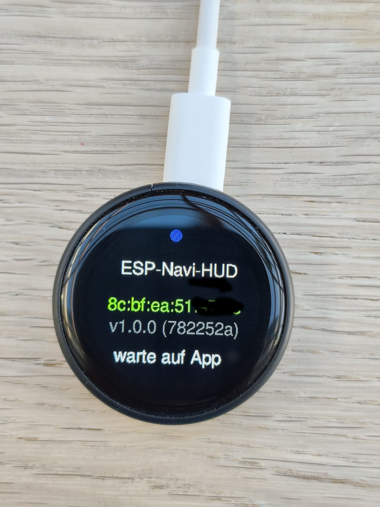
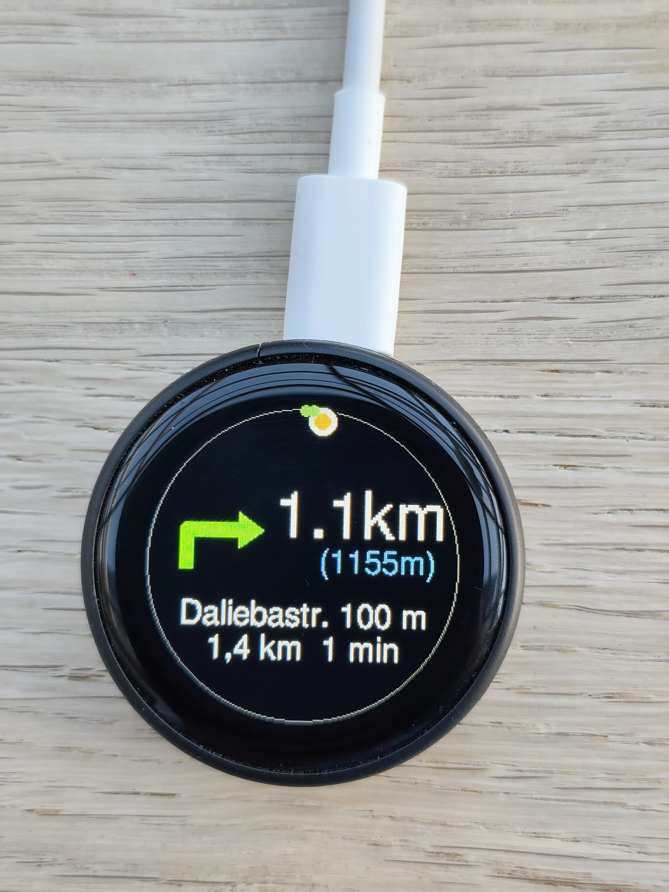
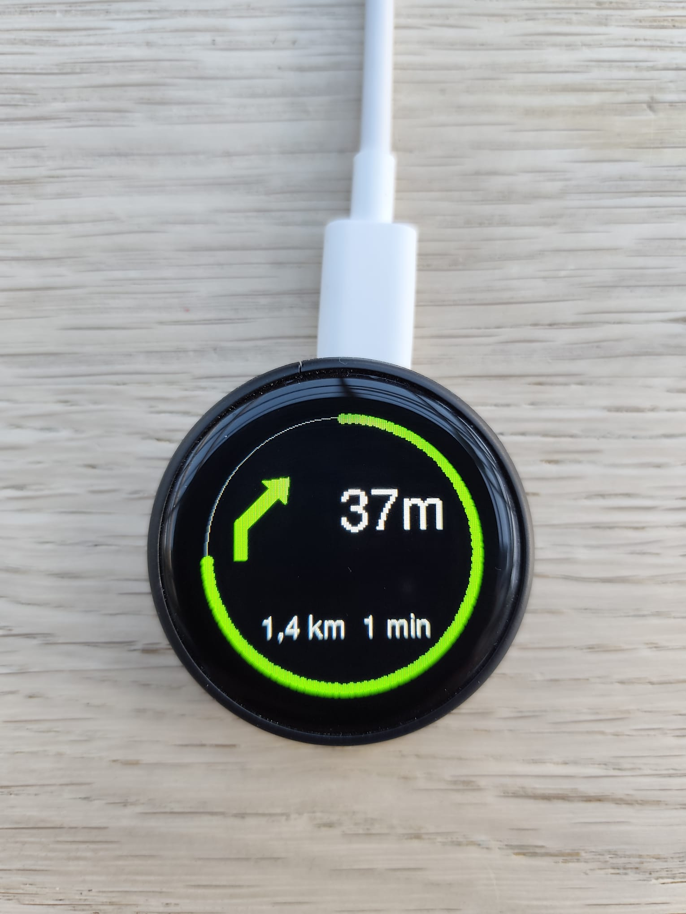

# BikeNav_C3 - Smart Bike HUD

BikeNav_C3 ist ein minimalistisches, Bluetooth-basiertes Head-Up-Display (HUD) für Fahrräder, basierend auf dem ESP32-C3 und einem 1.28" Rund-Display (GC9A01). 

### Wofür ist dieses Device?
Das BikeNav_C3 verwandelt dein Smartphone in ein diskretes Navigationssystem. Anstatt während der Fahrt ständig auf das Handy am Lenker schauen zu müssen, liefert das HUD präzise Richtungsanweisungen direkt in dein Sichtfeld. Es ist ideal für:
* **Sicheres Radfahren**: Fokus bleibt auf der Straße, nicht auf dem Smartphone-Display.
* **Minimalistisches Cockpit**: Kein klobiges Handy am Lenker, sondern ein elegantes, rundes Display.
* **Wetterunabhängigkeit**: Das Display ist auch bei direkter Sonneneinstrahlung gut ablesbar.


<table>
  <tr>
    <td></td>
    <td></td>
    <td></td>
  </tr>
</table>

## 📲 Die Android Bridge App
Das Herzstück des Systems ist die Kopplung mit der **Android Bridge App** [TTS2BluetoothSerial](../../../TTS2BluetoothSerial). Diese fungiert als intelligentes Bindeglied zwischen dem Smartphone und dem HUD:
* **TTS-Schnittstelle**: Die Bridge App nutzt die Sprachausgabe (Text-to-Speech) des Android-Systems und wandelt diese in Echtzeit in visuelle Befehle für das Display um.
* **Getestete Kompatibilität**: Das System ist unabhängig von der genutzten Karten-App. Es wurde erfolgreich getestet mit:
    * **Organic Maps** (und deren Forks)
    * **OsmAnd**
    * Allen Navigationssystemen, die standardisierte Android-Sprachanweisungen nutzen.

## ✨ Kernfunktionen
* **Echtzeit-Navigation**: Anzeige von Abbiegehinweisen (Icons), Distanzen und Straßennamen.
* **Smart Preview**: Vorausschauendes Icon für den darauffolgenden Manöver-Schritt ("Danach links").
* **Dynamische Distanzberechnung**: Automatisches Herunterzählen der Meter basierend auf der aktuellen Geschwindigkeit (`SPD-CALC`), auch wenn die App gerade keine Daten sendet.
* **Intelligentes UI**: 
    * Startscreen mit MAC-Adresse zur einfachen Kopplung.
    * Farbliches Feedback bei kritischen Distanzen (Orange-Alarm bei < 30m).
* **Gestensteuerung**: Helligkeitsregelung und Display-Rotation (0-270°) per Touch-Geste am Display.

## 🛠 Hardware
* **Controller**: ESP32-C3 (RISC-V).
* **Display**: 1.28 Zoll Round-LCD, 240x240 Pixel, IPS.
* **Touch**: Kapazitiver CST816S Controller.
* **Kompatibilität**: Der Code ist für das ESP32-2424S012 Display (häufig auf AliExpress zu finden) oder ähnliche GC9A01-basierte Displays anpassbar.

## 🚀 Schnellstart & Installation

### Installation via PlatformIO
1. **Vorbereitung**: Installiere [PlatformIO](https://platformio.org/) (als VS Code Extension).
2. **Kompilieren & Flashen**:
   - Verbinde den ESP32-C3 via USB.
   - Öffne das Projekt in VS Code.
   - Nutze den "Upload"-Button in der PlatformIO-Leiste.
   - Die `platformio.ini` konfiguriert automatisch die notwendigen Bibliotheken (`GFX Library`, `NimBLE`, `CST816S`).
3. **Überwachung**: Öffne den Serial Monitor (Baudrate: 115200), um den Boot-Vorgang und BLE-Status zu sehen.

### Alternative Installationsmethoden (ohne PlatformIO)
Falls du PlatformIO nicht nutzen möchtest, kannst du die kompilierte `.bin`-Datei direkt flashen:

#### 1. ESP32 Download Tool (Windows)
1. Lade das [Flash Download Tool](https://www.espressif.com/en/support/download/other-tools) von Espressif herunter.
2. Wähle "ESP32" als Chip-Typ.
3. Wähle die `.bin`-Datei aus.
4. Setze die Flash-Adresse auf `0x10000`.
5. Wähle den COM-Port aus und klicke auf **START**.

#### 2. esptool.py (Kommandozeile)
1. Installiere esptool: `pip install esptool`
2. Führe folgenden Befehl aus (ersetze `COMx` durch deinen Port):
   ```bash
   esptool.py --chip esp32 --port COMx --baud 460800 write_flash -z 0x10000 pfad/zu/datei.bin
   ```

*Hinweis: Falls das Gerät nicht automatisch in den Flash-Modus wechselt, halte die `BOOT`-Taste gedrückt, drücke kurz `RESET` und lasse `BOOT` wieder los.*

### Koppeln
1. Starte die Android Bridge App.
2. Suche nach "BikeNav_C3".
3. Sobald verbunden, zeigt das Display den Navigations-Screen.

